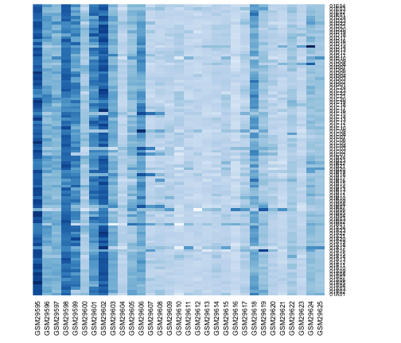
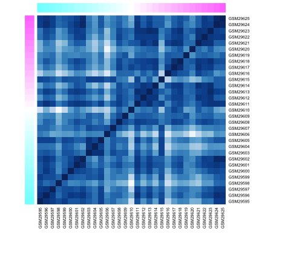
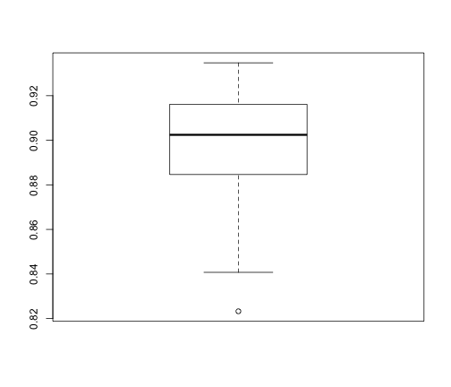
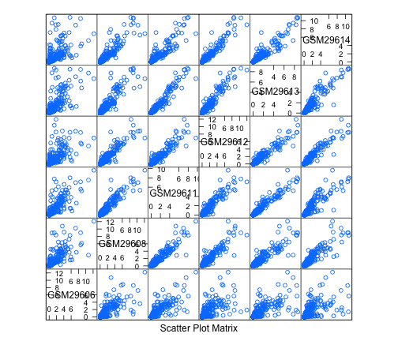
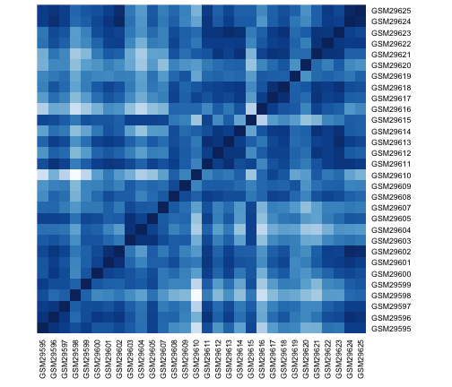
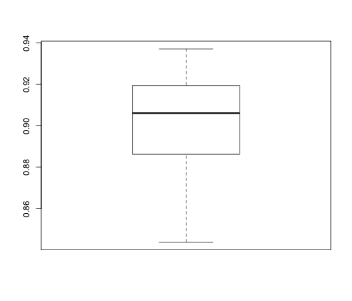
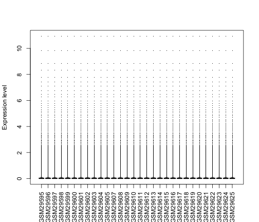

### Task 2: Quality control
### created by Omar AlOmeir
### date: March 18, 2014


```r
library(RColorBrewer)
library(lattice)
library(preprocessCore)
library(impute)
```


Reading the data from the intake:

```r
dat <- read.table("data/GSE1710-data.tsv")
des <- readRDS("data/GSE1710-design.rds")
str(dat, max.level = 0)
```

```
## 'data.frame':	34560 obs. of  31 variables:
```

```r
str(des)
```

```
## 'data.frame':	31 obs. of  4 variables:
##  $ samples: Factor w/ 31 levels "GSM29595","GSM29596",..: 1 2 3 4 5 6 7 8 9 10 ...
##  $ group  : Factor w/ 3 levels "NC","CD","UC": 1 1 1 1 1 1 1 1 1 1 ...
##  $ sex    : Factor w/ 2 levels "female","male": 2 1 2 2 1 1 1 1 1 2 ...
##  $ age    : Factor w/ 25 levels "18","19","20",..: 15 17 6 20 16 21 25 7 24 23 ...
```


heatmap of the first 100 rows before dealing with missing values:

```r
mat <- as.matrix(dat)
bluesFun <- colorRampPalette(brewer.pal(n = 9, "Blues"))
heatmap(mat[1:100, ], Rowv = NA, Colv = NA, col = bluesFun(256))
```

 


Dealing with missing values:

```r
# remove rows that contain more than 8 (25%) missing values
dat <- dat[rowSums(is.na(dat)) <= 8, ]
str(dat, max.level = 0)
```

```
## 'data.frame':	28993 obs. of  31 variables:
```

We have 28993 rows left.


```r
# use knn to impute other NAs
mat <- as.matrix(dat)
mat <- impute.knn(mat)
```

```
## Cluster size 28993 broken into 667 28326 
## Done cluster 667 
## Cluster size 28326 broken into 2918 25408 
## Cluster size 2918 broken into 876 2042 
## Done cluster 876 
## Cluster size 2042 broken into 1247 795 
## Done cluster 1247 
## Done cluster 795 
## Done cluster 2042 
## Done cluster 2918 
## Cluster size 25408 broken into 5314 20094 
## Cluster size 5314 broken into 1876 3438 
## Cluster size 1876 broken into 1055 821 
## Done cluster 1055 
## Done cluster 821 
## Done cluster 1876 
## Cluster size 3438 broken into 1500 1938 
## Done cluster 1500 
## Cluster size 1938 broken into 1065 873 
## Done cluster 1065 
## Done cluster 873 
## Done cluster 1938 
## Done cluster 3438 
## Done cluster 5314 
## Cluster size 20094 broken into 13001 7093 
## Cluster size 13001 broken into 5682 7319 
## Cluster size 5682 broken into 362 5320 
## Done cluster 362 
## Cluster size 5320 broken into 2948 2372 
## Cluster size 2948 broken into 1522 1426 
## Cluster size 1522 broken into 426 1096 
## Done cluster 426 
## Done cluster 1096 
## Done cluster 1522 
## Done cluster 1426 
## Done cluster 2948 
## Cluster size 2372 broken into 1272 1100 
## Done cluster 1272 
## Done cluster 1100 
## Done cluster 2372 
## Done cluster 5320 
## Done cluster 5682 
## Cluster size 7319 broken into 4042 3277 
## Cluster size 4042 broken into 2446 1596 
## Cluster size 2446 broken into 1102 1344 
## Done cluster 1102 
## Done cluster 1344 
## Done cluster 2446 
## Cluster size 1596 broken into 938 658 
## Done cluster 938 
## Done cluster 658 
## Done cluster 1596 
## Done cluster 4042 
## Cluster size 3277 broken into 1592 1685 
## Cluster size 1592 broken into 1006 586 
## Done cluster 1006 
## Done cluster 586 
## Done cluster 1592 
## Cluster size 1685 broken into 1480 205 
## Done cluster 1480 
## Done cluster 205 
## Done cluster 1685 
## Done cluster 3277 
## Done cluster 7319 
## Done cluster 13001 
## Cluster size 7093 broken into 4284 2809 
## Cluster size 4284 broken into 2646 1638 
## Cluster size 2646 broken into 1128 1518 
## Done cluster 1128 
## Cluster size 1518 broken into 199 1319 
## Done cluster 199 
## Done cluster 1319 
## Done cluster 1518 
## Done cluster 2646 
## Cluster size 1638 broken into 559 1079 
## Done cluster 559 
## Done cluster 1079 
## Done cluster 1638 
## Done cluster 4284 
## Cluster size 2809 broken into 2025 784 
## Cluster size 2025 broken into 551 1474 
## Done cluster 551 
## Done cluster 1474 
## Done cluster 2025 
## Done cluster 784 
## Done cluster 2809 
## Done cluster 7093 
## Done cluster 20094 
## Done cluster 25408 
## Done cluster 28326
```

```r
dat <- as.data.frame(mat$data)
str(dat, max.level = 0)
```

```
## 'data.frame':	28993 obs. of  31 variables:
```


Heatmap of the first 100 rows:

```r
mat <- as.matrix(dat)
bluesFun <- colorRampPalette(brewer.pal(n = 9, "Blues"))
heatmap(mat[1:100, ], Rowv = NA, Colv = NA, col = bluesFun(256))
```

 


Smaples correlation heatmap:

```r
sColors <- cm.colors(nrow(cor(mat)))
heatmap(cor(mat), Rowv = NA, Colv = NA, scale = "none", col = bluesFun(256), 
    ColSideColors = sColors, RowSideColors = sColors, margins = c(10, 10))
```

 


Boxplot of means of correlation to check for outliers:

```r
boxplot(apply(cor(mat), 2, mean))
```

 

```r
which.min(apply(cor(mat), 2, mean))
```

```
## GSM29606 
##       12
```


GSM29606 has the lowest correlation of all, and can be removed as an outlier.

```r
outlier <- subset(des, samples == "GSM29606")
olGroup <- subset(des, group == outlier$group & sex == outlier$sex)
splom(dat[olGroup$samples])
```

 


Removing the outlier:

```r
roDes <- subset(des, samples != "GSM29606")
roDat <- dat[roDes$samples]
heatmap(cor(as.matrix(roDat)), Rowv = NA, Colv = NA, scale = "none", col = bluesFun(256))
```

 

```r
boxplot(apply(cor(as.matrix(roDat)), 2, mean))
```

 

```r
which.min(apply(cor(as.matrix(roDat)), 2, mean))
```

```
## GSM29610 
##       15
```


A boxplot of the data before normalization:

```r
boxplot(roDat, pch = ".", ylab = "Expression level", las = 3)
```

 


Normalizing the data, using quantile normalization:

```r
nMat <- normalize.quantiles(as.matrix(roDat))
colnames(nMat) <- colnames(as.matrix(roDat))
rownames(nMat) <- rownames(as.matrix(roDat))
nDat <- as.data.frame(nMat)
```


A boxplot of the normalized data:

```r
boxplot(nDat, pch = ".", ylab = "Expression level", las = 3)
```

 


Saving the normalized data without the outlier:

```r
write.table(nDat, "data/GSE1710-normalized-data.tsv")
saveRDS(roDes, "data/GSE1710-outlier-removed-design.rds")
```

