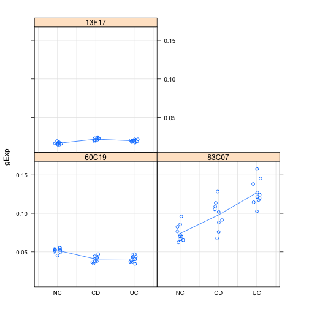
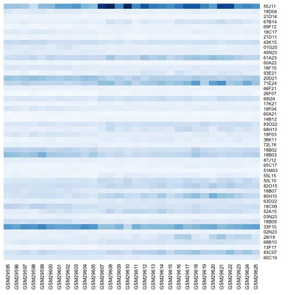
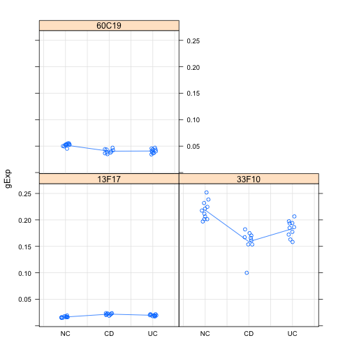
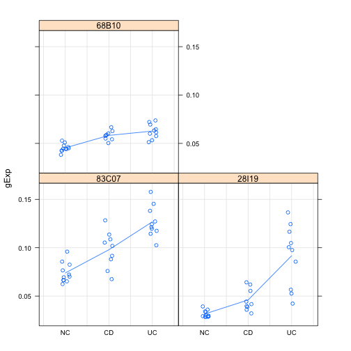
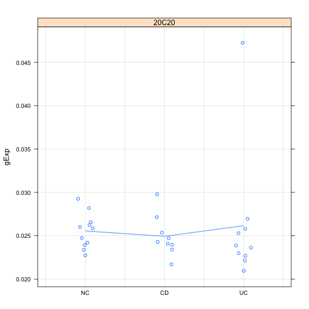

### 03 Differential Expression Analysis
### Created by: Abrar Wafa
### Date: April 3, 2014


```r
library(limma)
library(lattice)
library(car)
library(RColorBrewer)
```


Read the data: 

```r
dat <- read.table("../../data/GSE1710-normalized-data.tsv")
des <- readRDS("../../data/GSE1710-outlier-removed-design.rds")
```


Separate age into groups:

```r
des$age <- as.numeric(levels(des$age))[as.integer(des$age)]
young <- which(des$age <= 30)
middleage <- which(des$age > 30 & des$age < 50)
old <- which(des$age >= 50)
des$age[young] <- "young"
des$age[middleage] <- "middleage"
des$age[old] <- "old"
des$age <- as.factor(des$age)
des$age <- recode(des$age, "", levels = c("young", "middleage", "old"))
str(des)
```

```
## 'data.frame':	30 obs. of  4 variables:
##  $ samples: Factor w/ 31 levels "GSM29595","GSM29596",..: 1 2 3 4 5 6 7 8 9 10 ...
##  $ group  : Factor w/ 3 levels "NC","CD","UC": 1 1 1 1 1 1 1 1 1 1 ...
##  $ sex    : Factor w/ 2 levels "female","male": 2 1 2 2 1 1 1 1 1 2 ...
##  $ age    : Factor w/ 3 levels "young","middleage",..: 2 2 1 3 2 3 3 1 3 3 ...
```


Create function to extract genes:

```r
prepareData <- function(g) {
    pDat0 <- data.frame()
    for (i in 1:length(g)) {
        pDat <- data.frame(des, gExp = as.vector(t(as.matrix(dat[g[i], ]))), 
            gene = g[i])
        pDat0 <- rbind(pDat0, pDat)
    }
    pDat0
}
```


The used linear model is the ANOVA style, 'reference + treatment effects' parametrization:

\(Y_{ij}=\theta + \tau_i + \varepsilon_{ij} \) where \(\tau_1 = 0 \).

\(\mu_{NC}=\theta,  \mu_{CD}=\theta + \tau_2, \) and \(\mu_{UC}=\theta + \tau_3 \).


```r
desMat <- model.matrix(~group, des)
# Fitting two-way ANOVA to all probesets at once:
fit <- lmFit(dat, desMat)
ebFit <- eBayes(fit)
colnames(ebFit)
```

```
## [1] "(Intercept)" "groupCD"     "groupUC"
```


We will first use this model to test if all the means of the three genotypes are the same, if not, which genes have differential expression. In other words we will be testing the following null hypothesis: \(\mu_{CD} = \mu_{UC} \).

```r
hits <- topTable(ebFit, coef = grep("group", colnames(coef(ebFit))), number = nrow(dat), 
    p.value = 0.01)
# save the resutls
write.table(hits, "data/groups-hits.tsv")
```

```
## Warning: cannot open file 'data/groups-hits.tsv': No such file or
## directory
```

```
## Error: cannot open the connection
```

```r
str(hits)
```

```
## 'data.frame':	1283 obs. of  6 variables:
##  $ groupCD  : num  -0.01146 0.02397 0.00543 0.01289 0.01453 ...
##  $ groupUC  : num  -0.01119 0.05289 0.00317 0.01733 0.06028 ...
##  $ AveExpr  : num  0.0245 0.0454 0.0953 0.0276 0.0361 ...
##  $ F        : num  33.7 32.7 30.9 27.6 27.3 ...
##  $ P.Value  : num  3.38e-08 4.59e-08 7.92e-08 2.35e-07 2.54e-07 ...
##  $ adj.P.Val: num  0.000666 0.000666 0.000766 0.001165 0.001165 ...
```

There are 1283 probes that have a BH-adjusted p-value less than 1e-2.


Explore hits of all groups:

```r
stripplot(gExp ~ group | gene, prepareData(head(rownames(hits), 3)), jitter.data = TRUE, 
    auto.key = TRUE, type = c("p", "a"), grid = TRUE)
```

 


Explore non-hits of all groups:

```r
allprobes <- topTable(ebFit, coef = grep("group", colnames(coef(ebFit))), number = nrow(dat))
stripplot(gExp ~ group | gene, prepareData(tail(rownames(allprobes), 3)), jitter.data = TRUE, 
    auto.key = TRUE, type = c("p", "a"), grid = TRUE)
```

 


Display the top 50 probes in a heatmap:

```r
hit1 <- topTable(ebFit, coef = grep("group", colnames(coef(ebFit))), number = 50)
hGreys <- colorRampPalette(brewer.pal(n = 9, "Blues"))
hit1 <- dat[rownames(hit1), ]
heatmap(as.matrix(hit1), Rowv = NA, Colv = NA, scale = "none", col = hGreys(256))
```

 


We then use the same model to test for any effect of CD group by specifying the coefficient. In other words we will be testing the following null hypothesis: \(\mu_{CD} = 0 \).

```r
CDhits <- topTable(ebFit, coef = grep("CD", colnames(coef(ebFit))), number = nrow(dat), 
    p.value = 0.01)
write.table(CDhits, "data/CD-hits.tsv")
```

```
## Warning: cannot open file 'data/CD-hits.tsv': No such file or directory
```

```
## Error: cannot open the connection
```

```r
str(CDhits)
```

```
## 'data.frame':	1453 obs. of  6 variables:
##  $ logFC    : num  0.00543 -0.05977 -0.01146 0.04172 -0.02246 ...
##  $ AveExpr  : num  0.0191 0.1889 0.0447 0.0709 0.0558 ...
##  $ t        : num  7.77 -7.14 -7.01 7 -6.95 ...
##  $ P.Value  : num  1.77e-08 8.69e-08 1.23e-07 1.27e-07 1.45e-07 ...
##  $ adj.P.Val: num  0.000514 0.000777 0.000777 0.000777 0.000777 ...
##  $ B        : num  7.76 6.14 5.79 5.76 5.63 ...
```

There are 1453 probes that have a BH-adjusted p-value less than 1e-2.

Explore hits of CD groups:

```r
stripplot(gExp ~ group | gene, prepareData(head(rownames(CDhits), 3)), jitter.data = TRUE, 
    auto.key = TRUE, type = c("p", "a"), grid = TRUE)
```

 


Display the top 50 probes in a heatmap:

```r
hits2 <- topTable(ebFit, coef = grep("CD", colnames(coef(ebFit))), number = 50)
hit2 <- dat[rownames(hits2), ]
heatmap(as.matrix(hit2), Rowv = NA, Colv = NA, scale = "none", col = hGreys(256))
```

 


Finally, we use the same model to test for any effect of UC group by specifying the coefficient. In other words we will be testing the following null hypothesis: \(\mu_{UC} = 0 \).

```r
UChits <- topTable(ebFit, coef = grep("UC", colnames(coef(ebFit))), number = nrow(dat), 
    p.value = 0.01)
str(UChits)
```

```
## 'data.frame':	527 obs. of  6 variables:
##  $ logFC    : num  0.0529 0.0603 0.0173 0.0627 -0.0112 ...
##  $ AveExpr  : num  0.0987 0.0559 0.055 0.0972 0.0447 ...
##  $ t        : num  8.08 7.16 7.12 7.05 -7.04 ...
##  $ P.Value  : num  8.13e-09 8.35e-08 9.17e-08 1.12e-07 1.15e-07 ...
##  $ adj.P.Val: num  0.000236 0.000628 0.000628 0.000628 0.000628 ...
##  $ B        : num  8.53 6.16 6.06 5.86 5.83 ...
```

```r
write.table(UChits, "data/UC-hits.tsv")
```

```
## Warning: cannot open file 'data/UC-hits.tsv': No such file or directory
```

```
## Error: cannot open the connection
```

There are 527 probes that have a BH-adjusted p-value less than 1e-2.


Explore hits of UC groups:

```r
stripplot(gExp ~ group | gene, prepareData(head(rownames(UChits), 3)), jitter.data = TRUE, 
    auto.key = TRUE, type = c("p", "a"), grid = TRUE)
```

 


Display the top 50 probes in a heatmap:

```r
hits3 <- topTable(ebFit, coef = grep("UC", colnames(coef(ebFit))), number = 50)
hit3 <- dat[rownames(hits3), ]
heatmap(as.matrix(hit3), Rowv = NA, Colv = NA, scale = "none", col = hGreys(256))
```

 


Using 'reference + treatment effects' fit to test for group and age:

```r
aMat <- model.matrix(~group * age, des)
afit <- lmFit(dat, aMat)
aebFit <- eBayes(afit)
colnames(aebFit)
```

```
## [1] "(Intercept)"          "groupCD"              "groupUC"             
## [4] "agemiddleage"         "ageold"               "groupCD:agemiddleage"
## [7] "groupUC:agemiddleage" "groupCD:ageold"       "groupUC:ageold"
```


Test for any effect of group and/or age:

```r
aghits <- topTable(aebFit, coef = c("groupCD", "groupUC", "agemiddleage", "ageold", 
    "groupCD:agemiddleage", "groupUC:agemiddleage", "groupCD:ageold", "groupUC:ageold"), 
    number = nrow(dat), p.value = 0.1)
str(aghits)
```

```
## 'data.frame':	305 obs. of  12 variables:
##  $ groupCD             : num  0.000717 0.001196 -0.01649 0.015591 0.005498 ...
##  $ groupUC             : num  -0.00182 -0.00226 -0.01336 0.00802 0.00193 ...
##  $ agemiddleage        : num  0.000116 -0.001028 -0.000894 0.000548 0.000123 ...
##  $ ageold              : num  0.002288 -0.003518 -0.002314 0.004674 0.000114 ...
##  $ groupCD.agemiddleage: num  0.000094 -0.001653 0.006747 -0.001797 -0.000119 ...
##  $ groupUC.agemiddleage: num  0.001981 0.00186 0.001368 0.004494 0.000509 ...
##  $ groupCD.ageold      : num  -3.73e-03 -9.41e-05 9.95e-03 2.16e-03 -2.36e-03 ...
##  $ groupUC.ageold      : num  0.02232 0.01873 0.00796 0.01001 0.01588 ...
##  $ AveExpr             : num  0.1265 0.0611 0.0434 0.0385 0.0355 ...
##  $ F                   : num  15.2 12.7 12 11.9 10.5 ...
##  $ P.Value             : num  2.34e-07 1.12e-06 1.90e-06 2.06e-06 5.56e-06 ...
##  $ adj.P.Val           : num  0.0068 0.0149 0.0149 0.0149 0.0254 ...
```

There are 305 probes that have a BH-adjusted p-value less than 0.1.


Test for any effect of group only:

```r
ghits <- topTable(aebFit, coef = grep("group", colnames(coef(aebFit))), number = nrow(dat), 
    p.value = 0.1)
write.table(ghits, "data/groupVsage-hits.tsv")
```

```
## Warning: cannot open file 'data/groupVsage-hits.tsv': No such file or
## directory
```

```
## Error: cannot open the connection
```

```r
str(ghits)
```

```
## 'data.frame':	921 obs. of  10 variables:
##  $ groupCD             : num  0.001196 0.000717 0.015591 0.005498 -0.010262 ...
##  $ groupUC             : num  -0.00226 -0.00182 0.00802 0.00193 -0.00889 ...
##  $ groupCD.agemiddleage: num  -0.001653 0.000094 -0.001797 -0.000119 0.00956 ...
##  $ groupUC.agemiddleage: num  0.00186 0.001981 0.004494 0.000509 0.00738 ...
##  $ groupCD.ageold      : num  -9.41e-05 -3.73e-03 2.16e-03 -2.36e-03 9.31e-03 ...
##  $ groupUC.ageold      : num  0.0187 0.0223 0.01 0.0159 0.0107 ...
##  $ AveExpr             : num  0.0371 0.0474 0.0612 0.0356 0.0239 ...
##  $ F                   : num  16.7 16.4 15.5 14 13.5 ...
##  $ P.Value             : num  3.36e-07 3.90e-07 6.19e-07 1.55e-06 2.09e-06 ...
##  $ adj.P.Val           : num  0.00566 0.00566 0.00598 0.01121 0.01132 ...
```

There are 921 probes that have a BH-adjusted p-value less than 0.1.


Test for any effect of age only:

```r
ahits <- topTable(aebFit, coef = grep("age", colnames(coef(aebFit))), number = nrow(dat), 
    p.value = 0.1)
str(ahits)
```

```
## 'data.frame':	4 obs. of  10 variables:
##  $ agemiddleage        : num  0.000116 -0.001028 0.000942 0.002625
##  $ ageold              : num  0.002288 -0.003518 -0.001751 0.000294
##  $ groupCD.agemiddleage: num  0.000094 -0.001653 0.000352 -0.003199
##  $ groupUC.agemiddleage: num  0.001981 0.00186 0.000486 -0.00382
##  $ groupCD.ageold      : num  -3.73e-03 -9.41e-05 1.86e-03 7.10e-04
##  $ groupUC.ageold      : num  0.0223 0.0187 0.0231 0.0128
##  $ AveExpr             : num  0.0649 0.0682 0.0662 0.1328
##  $ F                   : num  20 15.9 13.4 11.5
##  $ P.Value             : num  6.57e-08 5.20e-07 2.11e-06 7.56e-06
##  $ adj.P.Val           : num  0.00191 0.00754 0.02038 0.0548
```

There are only 4 probes that have a BH-adjusted p-value less than 0.1 which means there is no significant effect for age.

Explore hits of age only:

```r
stripplot(gExp ~ group | gene, prepareData(head(rownames(ahits), 4)), jitter.data = TRUE, 
    auto.key = TRUE, type = c("p", "a"), grid = TRUE)
```

 


Use 'reference + treatment effects' fit to test for group and sex:

```r
sMat <- model.matrix(~group * sex, des)
sfit <- lmFit(dat, sMat)
sebFit <- eBayes(sfit)
colnames(sebFit)
```

```
## [1] "(Intercept)"     "groupCD"         "groupUC"         "sexmale"        
## [5] "groupCD:sexmale" "groupUC:sexmale"
```


Test for any effect of group and/or sex:

```r
sghits <- topTable(sebFit, coef = c("groupCD", "groupUC", "sexmale", "groupCD:sexmale", 
    "groupUC:sexmale"), number = nrow(dat), p.value = 0.01)
str(sghits)
```

```
## 'data.frame':	244 obs. of  9 variables:
##  $ groupCD        : num  0.168897 0.017426 0.006217 -0.00409 0.000551 ...
##  $ groupUC        : num  -0.00793 0.12174 0.05666 -0.0047 0.02941 ...
##  $ sexmale        : num  -0.0225 0.00651 -0.0018 0.0056 -0.00321 ...
##  $ groupCD.sexmale: num  -0.12666 0.04815 0.03257 -0.00732 0.00374 ...
##  $ groupUC.sexmale: num  0.00457 -0.07803 -0.00372 -0.00518 -0.02304 ...
##  $ AveExpr        : num  0.0455 0.0542 0.0725 0.0438 0.0485 ...
##  $ F              : num  27.2 20.8 20.4 20.3 19.9 ...
##  $ P.Value        : num  2.17e-09 3.39e-08 4.07e-08 4.25e-08 5.13e-08 ...
##  $ adj.P.Val      : num  6.28e-05 2.97e-04 2.97e-04 2.97e-04 2.97e-04 ...
```

There are 244 probes that have a BH-adjusted p-value less than 1e-2.

Test for any effect of group only:

```r
gHits <- topTable(sebFit, coef = grep("group", colnames(coef(sebFit))), number = nrow(dat), 
    p.value = 0.01)
str(gHits)
```

```
## 'data.frame':	417 obs. of  8 variables:
##  $ groupCD        : num  0.168897 -0.00409 0.000551 0.017426 0.010377 ...
##  $ groupUC        : num  -0.00793 -0.0047 0.02941 0.12174 0.04779 ...
##  $ groupCD.sexmale: num  -0.12666 -0.00732 0.00374 0.04815 0.02284 ...
##  $ groupUC.sexmale: num  0.00457 -0.00518 -0.02304 -0.07803 -0.03113 ...
##  $ AveExpr        : num  0.3226 0.0275 0.0491 0.0567 0.0509 ...
##  $ F              : num  25.6 25.3 23.4 23.4 23.3 ...
##  $ P.Value        : num  1.48e-08 1.71e-08 3.64e-08 3.68e-08 3.75e-08 ...
##  $ adj.P.Val      : num  0.000217 0.000217 0.000217 0.000217 0.000217 ...
```

There are 417 probes that have a BH-adjusted p-value less than 1e-2.


Test for any effect of sex:

```r
shits <- topTable(sebFit, coef = grep("sex", colnames(coef(sebFit))), number = nrow(dat), 
    p.value = 0.01)
str(shits)
```

```
## 'data.frame':	1 obs. of  7 variables:
##  $ sexmale        : num -0.00321
##  $ groupCD.sexmale: num 0.00374
##  $ groupUC.sexmale: num -0.023
##  $ AveExpr        : num 0.133
##  $ F              : num 22.7
##  $ P.Value        : num 2.48e-07
##  $ adj.P.Val      : num 0.00719
```

There is only 1 probe that have a BH-adjusted p-value less than 1e-2 which means there is no significant effect for sex.

Explore hits of sex only:

```r
stripplot(gExp ~ group | gene, prepareData(head(rownames(ahits), 1)), jitter.data = TRUE, 
    auto.key = TRUE, type = c("p", "a"), grid = TRUE)
```

 

