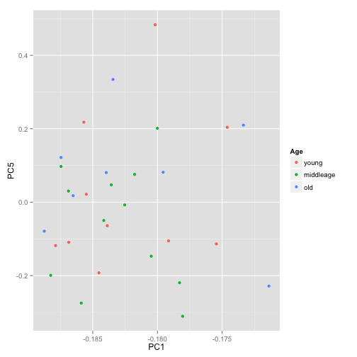

Task 4: PCA and clustering
========================================================
# Created by : Yiming Zhang
# Date : April 6, 2014

This is an R Markdown document for PCA and clustering analysis

## Load data and needed packages
Load the essential packages,

```r
library(RColorBrewer)
library(cluster)
library(pvclust)
library(xtable)
library(limma)
library(plyr)
library(ggplot2)
library(car)
library(lattice)
library(scatterplot3d)
```

Read the design matrix and normalized data and have a simple check

```r
dat <- read.table("data/GSE1710-normalized-data.tsv")
des <- readRDS("data/GSE1710-outlier-removed-design.rds")
# separate age into three groups
des$age <- as.numeric(levels(des$age))[as.integer(des$age)]
young <- which(des$age <= 30)
middleage <- which(des$age > 30 & des$age < 50)
old <- which(des$age >= 50)
des$age[young] <- "young"
des$age[middleage] <- "middleage"
des$age[old] <- "old"
des$age <- as.factor(des$age)
des$age <- recode(des$age, "", levels = c("young", "middleage", "old"))
str(dat, max.level = 0)
```

```
## 'data.frame':	28993 obs. of  30 variables:
```

```r
str(des)
```

```
## 'data.frame':	30 obs. of  4 variables:
##  $ samples: Factor w/ 31 levels "GSM29595","GSM29596",..: 1 2 3 4 5 6 7 8 9 10 ...
##  $ group  : Factor w/ 3 levels "NC","CD","UC": 1 1 1 1 1 1 1 1 1 1 ...
##  $ sex    : Factor w/ 2 levels "female","male": 2 1 2 2 1 1 1 1 1 2 ...
##  $ age    : Factor w/ 3 levels "young","middleage",..: 2 2 1 3 2 3 3 1 3 3 ...
```


## PCA (Principal Components Analysis)
Do PCA

```r
pcs <- prcomp(dat, center = F, scale = F)
```

Check the principle components histogram,

```r
plot(pcs)
```

 

Then check how the first few PCs relate to covariates

```r
prinComp <- cbind(des, pcs$rotation)
plot(prinComp[, c("group", "sex", "age", "PC1", "PC2", "PC3")], pch = 19, cex = 0.8)
```

 

In this plot, it easy to tell that from first two components, samples in three experimental groups have significant different, but for sex and age, it's not so easy to tell the differences in these groups.

Plot PC1, PC2 and PC4 against each other to illustrate the differences between samples,

```r
#Plot the 3-D scatterplot for PC1,PC2,PC4
# create column indicating point color
# code is modified from code at http://www.r-bloggers.com/getting-fancy-with-3-d-scatterplots/
Group <- des$group
prinComp$pcolor[Group=="NC"] <- "red"
prinComp$pcolor[Group=="CD"] <- "blue"
prinComp$pcolor[Group=="UC"] <- "green"
with(prinComp, {
  s3d <- scatterplot3d(PC2, PC4, PC1,        # x y and z axis
                       color=pcolor, pch=19,        # circle color indicates no. of cylinders
                       type="h", lty.hplot=2,       # lines to the horizontal plane
                       xlab="PC2 - 3.24%",
                       ylab="PC4 - 0.91%",
                       zlab="PC1 - 91.07%")
  s3d.coords <- s3d$xyz.convert(PC2, PC4, PC1)

  # add the legend
  legend("left", inset=.05,      # location and inset
         bty="n", cex=.5,              # suppress legend box, shrink text 50%
         title="Groups",
         c("NC", "UC", "CD"), fill=c("red", "blue", "green"))
})
```

 

from which we can see the normal control could be separated from IBD disease group, while the differences between CD and UC can hardly be explained.

Then look at the principle components in sex group,

```r
Sex <- des$sex
ggplot(prinComp, aes(x = PC1, y = PC2, colour = Sex)) + geom_point()
```

 

from which we can see most female subjects have higher PC2 score than male subjects, which means PC2 could be correlated with sex group.

then in age,

```r
Age <- des$age
ggplot(prinComp, aes(x = PC1, y = PC3, colour = Age)) + geom_point()
```

 

```r
ggplot(prinComp, aes(x = PC1, y = PC4, colour = Age)) + geom_point()
```

 

```r
ggplot(prinComp, aes(x = PC1, y = PC5, colour = Age)) + geom_point()
```

 

trying with 3 principle components, no sign of correlation showed. So age variation is not the main variation in this experiment, we could ignore this factor.

## Cluster analysis
### Preprocessing

```r
sdat <- t(scale(t(dat)))
str(sdat, max.level = 0, give.attr = FALSE)
```

```
##  num [1:28993, 1:30] 2.36 2.67 2.6 2.73 3.56 ...
```


```r
round(data.frame(avgBefore = rowMeans(head(dat)), avgAfter = rowMeans(head(sdat)), 
    varBefore = apply(head(dat), 1, var), varAfter = apply(head(sdat), 1, var)), 
    2)
```

```
##       avgBefore avgAfter varBefore varAfter
## 01A01      0.13        0         0        1
## 01A02      0.07        0         0        1
## 01A03      0.06        0         0        1
## 01A04      0.07        0         0        1
## 01A05      0.05        0         0        1
## 01A06      0.06        0         0        1
```

Data for each row now has mean 0 and variance 1.

### Sample clustering
In this part, we use samples as objects to be clustered using gene attributes.
#### Hierarchical clustering
Compute pairwise distance 

```r
pr.dis <- dist(t(sdat), method = "euclidean")
# pr.dis <- dist(t(sdat), method = 'manhattan') tried manhattan, manhattan
# have same results with euclidean
```


Create a new factor representing the interaction of experimental group with sex 

```r
des$grps <- with(des, interaction(group, sex))
summary(des$grps)
```

```
## NC.female CD.female UC.female   NC.male   CD.male   UC.male 
##         7         4         2         4         5         8
```


```r
pr.hc.s <- hclust(pr.dis, method = "single")
pr.hc.c <- hclust(pr.dis, method = "complete")
pr.hc.a <- hclust(pr.dis, method = "average")
pr.hc.w <- hclust(pr.dis, method = "ward")

# plot them
op <- par(mar = c(0, 4, 4, 2), mfrow = c(2, 2))

plot(pr.hc.s, labels = FALSE, main = "Single", xlab = "")
plot(pr.hc.c, labels = FALSE, main = "Complete", xlab = "")
plot(pr.hc.a, labels = FALSE, main = "Average", xlab = "")
plot(pr.hc.w, labels = FALSE, main = "Ward", xlab = "")
```

 

From the result, we can tell that "Ward" is better.

```r
par(op)

# identify 6 clusters
op <- par(mar = c(1, 4, 4, 1))
plot(pr.hc.w, labels = des$grps, cex = 0.6, main = "Ward showing 6 clusters")
rect.hclust(pr.hc.w, k = 6)
```

 


```r
op <- par(mar = c(1, 4, 4, 1))
plot(pr.hc.w, labels = des$grpa, cex = 0.6, main = "Ward showing 9 clusters")
rect.hclust(pr.hc.w, k = 9)
```

 


```r
op <- par(mar = c(1, 4, 4, 1))
plot(pr.hc.w, labels = des$group, cex = 0.6, main = "Ward showing 3 clusters")
rect.hclust(pr.hc.w, k = 3)
```

 

From the above clustering results, we can not find any pattern about group with age and also group with age.
#### K-means clustering


```r
# Objects in columns

set.seed(20)
# choose k
k <- 3
pr.km <- kmeans(t(sdat), centers = k, nstart = 50)

# We can look at the within sum of squares of each cluster
pr.km$withinss
```

```
## [1] 146222 259057 251508
```


```r
# We can look at the composition of each cluster

pr.kmTable <- data.frame(group = des$group, cluster = pr.km$cluster)
prTable <- xtable(with(pr.kmTable, table(group, cluster)), caption = "Number of samples from each experimental group  within each k-means cluster")
```


```r
align(prTable) <- "lccc"
print(prTable, type = "html", caption.placement = "top")
```

<!-- html table generated in R 3.0.2 by xtable 1.7-3 package -->
<!-- Sun Apr  6 14:56:56 2014 -->
<TABLE border=1>
<CAPTION ALIGN="top"> Number of samples from each experimental group  within each k-means cluster </CAPTION>
<TR> <TH>  </TH> <TH> 1 </TH> <TH> 2 </TH> <TH> 3 </TH>  </TR>
  <TR> <TD> NC </TD> <TD align="center">   5 </TD> <TD align="center">   3 </TD> <TD align="center">   3 </TD> </TR>
  <TR> <TD> CD </TD> <TD align="center">   0 </TD> <TD align="center">   5 </TD> <TD align="center">   4 </TD> </TR>
  <TR> <TD> UC </TD> <TD align="center">   0 </TD> <TD align="center">   5 </TD> <TD align="center">   5 </TD> </TR>
   </TABLE>


#### PAM clustering

```r
pr.pam <- pam(pr.dis, k = k)
pr.pamTable <- data.frame(group = des$group, cluster = pr.pam$clustering)
pamTable <- xtable(with(pr.pamTable, table(group, cluster)), caption = "Number of samples from each experimental group within each PAM cluster")
```


```r
align(pamTable) <- "lccc"
print(pamTable, type = "html", caption.placement = "top")
```

<!-- html table generated in R 3.0.2 by xtable 1.7-3 package -->
<!-- Sun Apr  6 14:56:56 2014 -->
<TABLE border=1>
<CAPTION ALIGN="top"> Number of samples from each experimental group within each PAM cluster </CAPTION>
<TR> <TH>  </TH> <TH> 1 </TH> <TH> 2 </TH> <TH> 3 </TH>  </TR>
  <TR> <TD> NC </TD> <TD align="center">   7 </TD> <TD align="center">   1 </TD> <TD align="center">   3 </TD> </TR>
  <TR> <TD> CD </TD> <TD align="center">   1 </TD> <TD align="center">   4 </TD> <TD align="center">   4 </TD> </TR>
  <TR> <TD> UC </TD> <TD align="center">   4 </TD> <TD align="center">   5 </TD> <TD align="center">   1 </TD> </TR>
   </TABLE>


```r
op <- par(mar = c(5, 1, 4, 4))
plot(pr.pam, main = "Silhouette Plot for 3 clusters")
```

 

Still no clear clusters showed consistent with experimental groups or sex groups.


### Gene clustering
Load the top 1283 hits data to do gene clustering,

```r
hits <- read.table("data/groups-hits.tsv")
topDat <- subset(dat, rownames(dat) %in% rownames(hits))
```

#### Hierarchical

```r
geneC.dis <- dist(topDat, method = "euclidean")

geneC.hc.a <- hclust(geneC.dis, method = "ward")

plot(geneC.hc.a, labels = FALSE, main = "Hierarchical with Ward Linkage", xlab = "")
```

 

#### Partitioning

```r
set.seed(1234)
k <- 5
kmeans.genes <- kmeans(topDat, centers = k)
op <- par(mfrow = c(2, 2))
for (clusterNum in 1:4) {
    # Set up the axes without plotting; ylim set based on trial run.
    plot(kmeans.genes$centers[clusterNum, ], ylim = c(-0.1, 10), type = "n", 
        xlab = "Samples", ylab = "Relative expression")
    
    # Plot the expression of all the genes in the selected cluster in grey.
    matlines(y = t(topDat[kmeans.genes$cluster == clusterNum, ]), col = "grey")
    
    # Add the cluster center. This is last so it isn't underneath the members
    points(kmeans.genes$centers[clusterNum, ], type = "l")
    
    # Optional: colored points to show which group the samples are from.
    points(kmeans.genes$centers[clusterNum, ], col = des$group, pch = 20)
}
```

 


#### Redefining the attributes: for sex
Define attributes by estimating parameters of a linear model.

For a linear model defined:
$$X_{gi,sex}=\mu_{g,sex}+\epsilon_{gi,sex} $$
Then we can define a new attributes for each gene, 
$$Att_{g}=(\mu_{g,female},\mu_{g,male})$$
and estimate these parameters.

```r
annoTopDat <- stack(as.data.frame(topDat))
annoTopDat$probeset <- rownames(topDat)  # add probeset ID as variable
## get info on group and sex, then average over reps within sex
annoTopDat <- merge(annoTopDat, des, by.x = "ind", by.y = "samples")
sexAvg <- ddply(annoTopDat, ~probeset, function(x) {
    avgBysex <- aggregate(values ~ sex, x, mean)$values
    names(avgBysex) <- levels(x$sex)
    avgBysex
})
## put probset info back into rownames
rownames(sexAvg) <- sexAvg$probeset
sexAvg$probeset <- NULL
str(sexAvg)
```

```
## 'data.frame':	1283 obs. of  2 variables:
##  $ female: num  0.0672 0.0686 0.0554 0.0606 0.0637 ...
##  $ male  : num  0.0631 0.0644 0.0518 0.0538 0.0606 ...
```


```r
heatmap(as.matrix(sexAvg), Colv = NA, col = jGraysFun(256), hclustfun = function(x) hclust(x, 
    method = "ward"), labCol = colnames(sexAvg), labRow = NA, margin = c(8, 
    1))
```

```
## Error: could not find function "jGraysFun"
```


```r
k <- 4
geneDS.km <- kmeans(sexAvg, centers = k, nstart = 50)
clust.centers <- geneDS.km$centers

# Look at all clusters
op <- par(mfrow = c(2, 2))
for (clusterNum in 1:4) {
    # Set up the axes without plotting; ylim set based on trial run.
    plot(clust.centers[clusterNum, ], ylim = c(-2, 2), type = "n", xlab = "Sex", 
        ylab = "Relative expression", axes = F, main = paste("Cluster", clusterNum, 
            sep = " "))
    axis(2)
    axis(1, 1:5, c(colnames(clust.centers)[1:4], "4W"), cex.axis = 0.9)
    
    # Plot the expression of all the genes in the selected cluster in grey.
    matlines(y = t(sexAvg[geneDS.km$cluster == clusterNum, ]), col = "grey")
    
    # Add the cluster center. This is last so it isn't underneath the members
    points(clust.centers[clusterNum, ], type = "l")
    
    # Optional: points to show sex.
    points(clust.centers[clusterNum, ], pch = 20)
}
```

 


```r
pvc <- pvclust(topDat, nboot = 100)
```

```
## Bootstrap (r = 0.5)... Done.
## Bootstrap (r = 0.6)... Done.
## Bootstrap (r = 0.7)... Done.
## Bootstrap (r = 0.8)... Done.
## Bootstrap (r = 0.9)... Done.
## Bootstrap (r = 1.0)... Done.
## Bootstrap (r = 1.1)... Done.
## Bootstrap (r = 1.2)... Done.
## Bootstrap (r = 1.3)... Done.
## Bootstrap (r = 1.4)... Done.
```


```r
plot(pvc, labels = des$grps, cex = 0.6)
pvrect(pvc, alpha = 0.95)
```

 


#### Redefining the attributes: for experimental group
Define attributes by estimating parameters of a linear model.

For a linear model defined:
$$X_{gi,group}=\mu_{g,group}+\epsilon_{gi,group} $$
Then we can define a new attributes for each gene, 
$$Att_{g}=(\mu_{g,NC},\mu_{g,CD},\mu_{g,UC})$$
and estimate these parameters.

```r
annoTopDat <- stack(as.data.frame(topDat))
annoTopDat$probeset <- rownames(topDat)  # add probeset ID as variable
## get info on group and sex, then average over reps within sex
annoTopDat <- merge(annoTopDat, des, by.x = "ind", by.y = "samples")
groupAvg <- ddply(annoTopDat, ~probeset, function(x) {
    avgBygroup <- aggregate(values ~ group, x, mean)$values
    names(avgBygroup) <- levels(x$group)
    avgBygroup
})
## put probset info back into rownames
rownames(groupAvg) <- groupAvg$probeset
groupAvg$probeset <- NULL
str(groupAvg)
```

```
## 'data.frame':	1283 obs. of  3 variables:
##  $ NC: num  0.0831 0.084 0.0675 0.0693 0.0787 ...
##  $ CD: num  0.0493 0.0519 0.0426 0.0468 0.048 ...
##  $ UC: num  0.0588 0.0595 0.0474 0.0519 0.056 ...
```


```r
heatmap(as.matrix(groupAvg), Colv = NA, col = jGraysFun(256), hclustfun = function(x) hclust(x, 
    method = "ward"), labCol = colnames(groupAvg), labRow = NA, margin = c(8, 
    1))
```

```
## Error: could not find function "jGraysFun"
```


```r
k <- 4
geneDS.km <- kmeans(groupAvg, centers = k, nstart = 50)
clust.centers <- geneDS.km$centers

# Look at all clusters
op <- par(mfrow = c(2, 2))
for (clusterNum in 1:4) {
    # Set up the axes without plotting; ylim set based on trial run.
    plot(clust.centers[clusterNum, ], ylim = c(-4, 4), type = "n", xlab = "Experimental Group", 
        ylab = "Relative expression", axes = F, main = paste("Cluster", clusterNum, 
            sep = " "))
    axis(2)
    axis(1, 1:5, c(colnames(clust.centers)[1:4], "4W"), cex.axis = 0.9)
    
    # Plot the expression of all the genes in the selected cluster in grey.
    matlines(y = t(groupAvg[geneDS.km$cluster == clusterNum, ]), col = "grey")
    
    # Add the cluster center. This is last so it isn't underneath the members
    points(clust.centers[clusterNum, ], type = "l")
    
    # Optional: points to show sex.
    points(clust.centers[clusterNum, ], pch = 20)
}
```

 


```r

plot(clust.centers[clusterNum, ], ylim = c(-4, 4), type = "n", xlab = "Experimental Group", 
    ylab = "Average expression", axes = FALSE, main = "Clusters centers")
axis(2)
axis(1, 1:5, c(colnames(clust.centers)[1:4], "4W"), cex.axis = 0.9)

for (clusterNum in 1:4) {
    points(clust.centers[clusterNum, ], type = "l", col = clusterNum, lwd = 2)
    points(clust.centers[clusterNum, ], col = clusterNum, pch = 20)
}
```

 


```r
cloud(groupAvg[, "NC"] ~ groupAvg[, "CD"] * groupAvg[, "UC"], col = geneDS.km$clust, 
    xlab = "NC", ylab = "CD", zlab = "UC")
```

 


```r
pvc <- pvclust(topDat, nboot = 100)
```

```
## Bootstrap (r = 0.5)... Done.
## Bootstrap (r = 0.6)... Done.
## Bootstrap (r = 0.7)... Done.
## Bootstrap (r = 0.8)... Done.
## Bootstrap (r = 0.9)... Done.
## Bootstrap (r = 1.0)... Done.
## Bootstrap (r = 1.1)... Done.
## Bootstrap (r = 1.2)... Done.
## Bootstrap (r = 1.3)... Done.
## Bootstrap (r = 1.4)... Done.
```


```r
plot(pvc, labels = des$group, cex = 0.6)
pvrect(pvc, alpha = 0.95)
```

 


