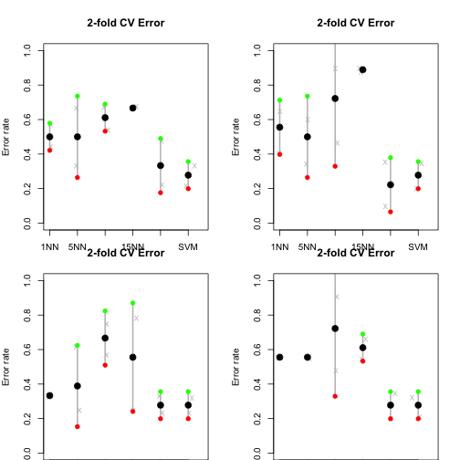
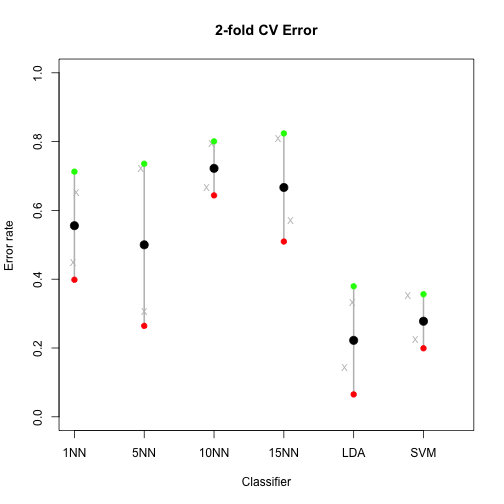

Task 5: Classification
========================================================
# Created by : Yiming Zhang
# Date : April 6, 2014

This is an R Markdown document for classification and cross validation analysis.

## Load data and needed packages
Load the essential packages,

```r
library(MASS)
library(reshape)
```

```
## Loading required package: plyr
## 
## Attaching package: 'reshape'
## 
## The following objects are masked from 'package:plyr':
## 
##     rename, round_any
```

```r
library(car)
library(limma)
library(e1071)
library(glmnet)
```

```
## Loading required package: Matrix
## 
## Attaching package: 'Matrix'
## 
## The following object is masked from 'package:reshape':
## 
##     expand
## 
## Loaded glmnet 1.9-5
```

```r
library(ROCR)
```

```
## Loading required package: gplots
## KernSmooth 2.23 loaded
## Copyright M. P. Wand 1997-2009
## 
## Attaching package: 'gplots'
## 
## The following object is masked from 'package:stats':
## 
##     lowess
```

```r
library(GEOquery)
```

```
## Loading required package: Biobase
## Loading required package: BiocGenerics
## Loading required package: parallel
## 
## Attaching package: 'BiocGenerics'
## 
## The following objects are masked from 'package:parallel':
## 
##     clusterApply, clusterApplyLB, clusterCall, clusterEvalQ,
##     clusterExport, clusterMap, parApply, parCapply, parLapply,
##     parLapplyLB, parRapply, parSapply, parSapplyLB
## 
## The following object is masked from 'package:Matrix':
## 
##     as.vector
## 
## The following object is masked from 'package:limma':
## 
##     plotMA
## 
## The following object is masked from 'package:stats':
## 
##     xtabs
## 
## The following objects are masked from 'package:base':
## 
##     anyDuplicated, append, as.data.frame, as.vector, cbind,
##     colnames, duplicated, eval, evalq, Filter, Find, get,
##     intersect, is.unsorted, lapply, Map, mapply, match, mget,
##     order, paste, pmax, pmax.int, pmin, pmin.int, Position, rank,
##     rbind, Reduce, rep.int, rownames, sapply, setdiff, sort,
##     table, tapply, union, unique, unlist
## 
## Welcome to Bioconductor
## 
##     Vignettes contain introductory material; view with
##     'browseVignettes()'. To cite Bioconductor, see
##     'citation("Biobase")', and for packages 'citation("pkgname")'.
## 
## Setting options('download.file.method.GEOquery'='auto')
```

```r
library(lattice)
library(class)
```

```
## 
## Attaching package: 'class'
## 
## The following object is masked from 'package:reshape':
## 
##     condense
```

```r
library(xtable)
```

Load the data

```r
dat <- read.table("data/GSE1710-normalized-data.tsv")
des <- readRDS("data/GSE1710-outlier-removed-design.rds")
```

Separate the samples into test set and training set

```r
# choose the samples manually
test.sample <- c(1, 2, 3, 9, 19, 11, 14, 20, 21, 26, 27, 30)
test.dat <- dat[, test.sample]

test.des <- des[test.sample, ]
train.dat <- dat[, -test.sample]
train.des <- des[-test.sample, ]

# save the two data set
saveRDS(train.des, file = "data/train_design.rds")
write.table(train.dat, "data/train_data.tsv")
saveRDS(test.des, file = "data/test_design.rds")
write.table(test.dat, "data/test_data.tsv")
```


Check the data we will use to do classification

```r
table(train.des$group)
```

```
## 
## NC CD UC 
##  6  6  6
```

```r
table(test.des$group)
```

```
## 
## NC CD UC 
##  5  3  4
```


## Classification and cross validation
### Feature and model selection

```r
nfold <- 2
tabTrain <- table(train.des$group)
indlist <- sapply(names(tabTrain), function(z) which(train.des$group == z), 
    simplify = FALSE)
set.seed(1234)
fold.NC <- matrix(sample(indlist[["NC"]]), nrow = nfold)
fold.CD <- matrix(sample(indlist[["CD"]]), nrow = nfold)
fold.UC <- matrix(sample(indlist[["UC"]]), nrow = nfold)

splits <- GenerateLearningsets(y = train.des$group, method = "CV", fold = 4, 
    strat = TRUE)
```

```
## Error: could not find function "GenerateLearningsets"
```

### Loop for feature selection and modeling
Here we use top-300 limma genes

```r
op <- par(mar = c(0, 4, 4, 2), mfrow = c(2, 2))
for (ngenes in c(100, 300, 500, 1000)) {
    nmethod <- 6
    pr.err <- matrix(-1, nfold, nmethod, dimnames = list(paste0("Fold", 1:nfold), 
        c("1NN", "5NN", "10NN", "15NN", "LDA", "SVM")))
    for (i in 1:nfold) {
        
        # Test Fold for the i-th step
        testdat.fold <- train.dat[, c(fold.NC[i, ], fold.CD[i, ], fold.UC[i, 
            ])]
        # I will create a factor of classes for the test set of the i_th fold
        testclass.fold <- train.des$group[c(fold.NC[i, ], fold.CD[i, ], fold.UC[i, 
            ])]
        
        
        # The rest of the samples are the training set for the i-th step
        traindat.fold <- train.dat[, -c(fold.NC[i, ], fold.CD[i, ], fold.UC[i, 
            ])]
        trainclass.fold <- train.des$group[-c(fold.NC[i, ], fold.CD[i, ], fold.UC[i, 
            ])]
        
        # Step 1: feature selection.
        
        # Note that a different set of genes will be selected for each fold! you can
        # then compare how consistent these sets were.
        
        limma.dat <- as.data.frame(traindat.fold)
        desMat <- model.matrix(~trainclass.fold, limma.dat)  #design matrix
        trainFit <- lmFit(limma.dat, desMat)
        eBtrainFit <- eBayes(trainFit)
        
        # top-n limma genes
        top.fold <- topTable(eBtrainFit, coef = which(colnames(coef(trainFit)) != 
            "(Intercept)"), n = ngenes, sort.by = "F")
        
        # Retain the top-200 limma genes from the train and test sets
        traindat.fold <- traindat.fold[rownames(top.fold), ]
        testdat.fold <- testdat.fold[rownames(top.fold), ]
        
        
        # STEP 2: select a classifier Set a counter for the method tested
        l <- 0
        
        # kNN classifiers
        for (kk in c(1, 5, 10, 15)) {
            # every time you get inside this loop, the l counter gets redefined (i.e.,
            # 1, 2, etc for method 1, method 2, etc)
            l <- l + 1
            
            # knn needs samples in rows
            yhat.knn <- knn(train = t(traindat.fold), test = t(testdat.fold), 
                cl = trainclass.fold, k = kk)
            # Store the prediction error for each kk within this fold
            pr.err[i, l] <- mean(testclass.fold != yhat.knn)
        }  #end of kNN loop
        
        # LDA method. Note that you can change the prior parameter to reflect a
        # different proportion of case and control samples. The default is to use
        # the class proportions from the training set.
        
        m.lda <- lda(x = t(traindat.fold), group = trainclass.fold)
        yhat.lda <- predict(m.lda, newdata = t(testdat.fold))$class
        pr.err[i, "LDA"] <- mean(testclass.fold != yhat.lda)
        
        # SVM
        m.svm <- svm(x = t(traindat.fold), y = trainclass.fold, cost = 1, type = "C-classification", 
            kernel = "linear")
        pr.svm <- predict(m.svm, newdata = t(testdat.fold))
        
        pr.err[i, "SVM"] <- mean(pr.svm != testclass.fold)
    }  #end of CV loop
    
    ## Error rate
    cv.err <- colMeans(pr.err)
    
    # mean - 1 sd (sd of the 6 error rates)
    ls <- cv.err - apply(pr.err, 2, sd)
    
    # mean + 1 sd (sd of the 6 error rates)
    us <- cv.err + apply(pr.err, 2, sd)
    
    # plot the results
    plot(1:nmethod, cv.err, ylim = c(0, 1), xlim = c(1, (nmethod + 0.5)), type = "n", 
        axes = FALSE, xlab = "Classifier", ylab = "Error rate", main = "2-fold CV Error")
    
    for (j in 1:ncol(pr.err)) points(jitter(rep(j, 2), factor = 2), jitter(pr.err[, 
        j]), cex = 0.8, pch = "X", col = "gray")
    
    for (i in 1:nmethod) lines(c(i, i), c(ls[i], us[i]), lwd = 2, col = "gray")
    points(1:nmethod, ls, pch = 19, col = "red")
    points(1:nmethod, us, pch = 19, col = "green")
    points(1:nmethod, cv.err, pch = 19, cex = 1.5, col = "black")
    axis(2, ylab = "Error rate")
    axis(1, 1:nmethod, colnames(pr.err))
    
    box()
}
```

```
## Warning: k = 10 exceeds number 9 of patterns
## Warning: k = 15 exceeds number 9 of patterns
## Warning: variables are collinear
## Warning: k = 10 exceeds number 9 of patterns
## Warning: k = 15 exceeds number 9 of patterns
## Warning: variables are collinear
## Warning: k = 10 exceeds number 9 of patterns
## Warning: k = 15 exceeds number 9 of patterns
## Warning: variables are collinear
## Warning: k = 10 exceeds number 9 of patterns
## Warning: k = 15 exceeds number 9 of patterns
## Warning: variables are collinear
## Warning: k = 10 exceeds number 9 of patterns
## Warning: k = 15 exceeds number 9 of patterns
## Warning: variables are collinear
## Warning: k = 10 exceeds number 9 of patterns
## Warning: k = 15 exceeds number 9 of patterns
## Warning: variables are collinear
## Warning: k = 10 exceeds number 9 of patterns
## Warning: k = 15 exceeds number 9 of patterns
## Warning: variables are collinear
## Warning: k = 10 exceeds number 9 of patterns
## Warning: k = 15 exceeds number 9 of patterns
## Warning: variables are collinear
```

 

From this plot, we can see that LDA method with 300 genes as feature has the lowest error rate.
### Testing the selected model, i.e. LDA with 300 top-hits

```r
negens <- 300
nmethod <- 6
pr.err <- matrix(-1, nfold, nmethod, dimnames = list(paste0("Fold", 1:nfold), 
    c("1NN", "5NN", "10NN", "15NN", "LDA", "SVM")))
for (i in 1:nfold) {
    
    # Test Fold for the i-th step
    testdat.fold <- train.dat[, c(fold.NC[i, ], fold.CD[i, ], fold.UC[i, ])]
    # I will create a factor of classes for the test set of the i_th fold
    testclass.fold <- train.des$group[c(fold.NC[i, ], fold.CD[i, ], fold.UC[i, 
        ])]
    
    
    # The rest of the samples are the training set for the i-th step
    traindat.fold <- train.dat[, -c(fold.NC[i, ], fold.CD[i, ], fold.UC[i, ])]
    trainclass.fold <- train.des$group[-c(fold.NC[i, ], fold.CD[i, ], fold.UC[i, 
        ])]
    
    # Step 1: feature selection.
    
    # Note that a different set of genes will be selected for each fold! you can
    # then compare how consistent these sets were.
    
    limma.dat <- as.data.frame(traindat.fold)
    desMat <- model.matrix(~trainclass.fold, limma.dat)  #design matrix
    trainFit <- lmFit(limma.dat, desMat)
    eBtrainFit <- eBayes(trainFit)
    
    # top-200 limma genes
    top.fold <- topTable(eBtrainFit, coef = which(colnames(coef(trainFit)) != 
        "(Intercept)"), n = 300, sort.by = "F")
    
    # Retain the top-200 limma genes from the train and test sets
    traindat.fold <- traindat.fold[rownames(top.fold), ]
    testdat.fold <- testdat.fold[rownames(top.fold), ]
    
    
    # STEP 2: select a classifier Set a counter for the method tested
    l <- 0
    
    # kNN classifiers
    for (kk in c(1, 5, 10, 15)) {
        # every time you get inside this loop, the l counter gets redefined (i.e.,
        # 1, 2, etc for method 1, method 2, etc)
        l <- l + 1
        
        # knn needs samples in rows
        yhat.knn <- knn(train = t(traindat.fold), test = t(testdat.fold), cl = trainclass.fold, 
            k = kk)
        # Store the prediction error for each kk within this fold
        pr.err[i, l] <- mean(testclass.fold != yhat.knn)
    }  #end of kNN loop
    
    # LDA method. Note that you can change the prior parameter to reflect a
    # different proportion of case and control samples. The default is to use
    # the class proportions from the training set.
    
    m.lda <- lda(x = t(traindat.fold), group = trainclass.fold)
    yhat.lda <- predict(m.lda, newdata = t(testdat.fold))$class
    pr.err[i, "LDA"] <- mean(testclass.fold != yhat.lda)
    
    # SVM
    m.svm <- svm(x = t(traindat.fold), y = trainclass.fold, cost = 1, type = "C-classification", 
        kernel = "linear")
    pr.svm <- predict(m.svm, newdata = t(testdat.fold))
    
    pr.err[i, "SVM"] <- mean(pr.svm != testclass.fold)
}  #end of CV loop
```

```
## Warning: k = 10 exceeds number 9 of patterns
## Warning: k = 15 exceeds number 9 of patterns
## Warning: variables are collinear
## Warning: k = 10 exceeds number 9 of patterns
## Warning: k = 15 exceeds number 9 of patterns
## Warning: variables are collinear
```

```r

## Error rate
cv.err <- colMeans(pr.err)

# mean - 1 sd (sd of the 6 error rates)
ls <- cv.err - apply(pr.err, 2, sd)

# mean + 1 sd (sd of the 6 error rates)
us <- cv.err + apply(pr.err, 2, sd)

# plot the results
plot(1:nmethod, cv.err, ylim = c(0, 1), xlim = c(1, (nmethod + 0.5)), type = "n", 
    axes = FALSE, xlab = "Classifier", ylab = "Error rate", main = "2-fold CV Error")

for (j in 1:ncol(pr.err)) points(jitter(rep(j, 2), factor = 2), jitter(pr.err[, 
    j]), cex = 0.8, pch = "X", col = "gray")

for (i in 1:nmethod) lines(c(i, i), c(ls[i], us[i]), lwd = 2, col = "gray")
points(1:nmethod, ls, pch = 19, col = "red")
points(1:nmethod, us, pch = 19, col = "green")
points(1:nmethod, cv.err, pch = 19, cex = 1.5, col = "black")
axis(2, ylab = "Error rate")
axis(1, 1:nmethod, colnames(pr.err))

box()
```

 


```r
m.lda <- lda(x = t(traindat.fold), group = trainclass.fold)
```

```
## Warning: variables are collinear
```

```r
yhat.lda <- predict(m.lda, newdata = t(testdat.fold))$class
pr.err.lda <- mean(testclass.fold != yhat.lda)
pr.err.lda
```

```
## [1] 0.1111
```

So we get the error rate 0.1111, it's a very promising results. But further experiment with more test samples are expected to further verify the results.


